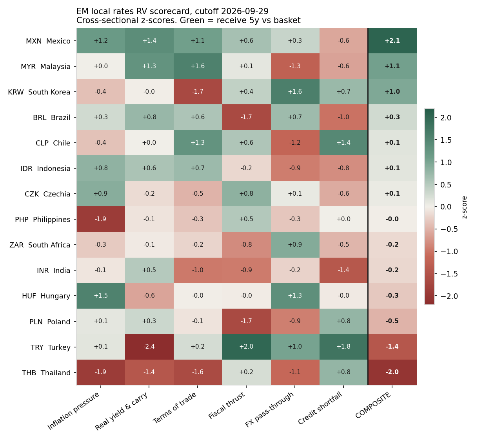

# Cross-Country EM Local Rates Relative Value

EM Local Rates RV model using six distinct factors to ranks 17 different emerging-market
local-currency rates markets against each other. We trade the dispersion as a
market-neutral, volatility-targeted book of 5-year receivers.

```bash
pip install -r requirements.txt
python -m pipeline.fetch_all            # download all sources (~5 min)
python run.py                           # backtest + diagnostics -> output/
python live.py --capital 10000000       # today's target book and trade list
python -m pytest -q tests               # look-ahead tests
```
---

## 1. Results

The evaluation window is Feb-2011 to Jul-2026: 186 months, starting once the
expanding-window ridge has 36 months of training history. On average 11.2
markets pass the data rules each month.

| | Ridge gross | **Ridge net** | Parity gross | Parity net |
|---|---|---|---|---|
| Ann. return % | 9.90 | **6.37** | 7.59 | 3.66 |
| Ann. vol % (target 10, ex-ante) | 10.11 | 10.10 | 9.85 | 9.88 |
| **Sharpe** | 0.98 | **0.63** | 0.77 | 0.37 |
| Sharpe t-stat | 3.86 | 2.48 | 3.04 | 1.46 |
| Max drawdown % | −14.7 | −18.0 | −13.7 | −20.1 |
| Worst month % | −13.1 | −13.4 | −9.6 | −10.2 |
| Hit rate | 0.61 | 0.58 | 0.59 | 0.53 |

* Net PnL beta is **0.028** (t = 0.25, correlation
  0.02) against an equal-risk basket of 5y receivers
Trading costs 2.18% a year and the annual re-strike roll costs
  1.36% a year, together **3.5%/yr of the 9.9% gross return**. Average gross
  swap notional is 7.5× capital.
* Monthly rank IC against the next month's vol-adjusted receiver return:
  0.095 for the ridge composite (t = 3.6) and 0.070 for parity. The mean across
  the six individual factors is 0.029.

### Robustness (ridge book, net Sharpe)

| Test | Net Sharpe |
|---|---|
| Costs ×0 / ×1 / ×2 / ×3 | 0.98 / **0.63** / 0.28 / −0.07 |
| Rebalance speed 1.0 / **0.5** / 0.33 | 0.51 / **0.63** / 0.68 |
| 2011–15 / 2016–20 / 2021–26 | 0.76 / 0.54 / 0.62 |
| Excluding Turkey | 0.58 |

The strategy breaks even at roughly 2.9× the assumed bid-offer

### Scorecard



## 2. Data

| Input | Source & endpoint | Frequency | Release lag used |
|---|---|---|---|
| 5y and 10y govt benchmark yields | TradingView `TVC:{cc}05Y` / `{cc}10Y` (Refinitiv-sourced) via `wss://data.tradingview.com` | daily | 0 (close) |
| Policy rates (funding leg) | BIS `WS_CBPOL`, daily | daily | 0 |
| CPI index | BIS `WS_LONG_CPI` | monthly | 1 month |
| Real broad effective exchange rate | BIS `WS_EER` (R.B) | monthly | 1 month |
| Credit-to-GDP gap | BIS `WS_CREDIT_GAP` | quarterly | 6 months |
| Commodity terms of trade | IMF `CTOT`, `CEMPI_CTOTXM_GDP`, rolling weights | monthly | 4 months |
| General govt net lending, %GDP | IMF WEO `GGXCNL_NGDP` via `api.imf.org` | annual | outturn usable from April of Y+1 |
| Trade openness | World Bank WDI `NE.TRD.GNFS.ZS` | annual | 12 months |
| QA cross-check only | FRED / OECD MEI 10y (`IRLTLT01xxM156N`) | monthly | n/a |
| Inflation targets | Central bank framework pages, by effective year (`config.INFLATION_TARGETS`) | — | — |

At each cutoff a market is eligible only if all of these hold:

* its last 5y print is no more than 10 days old;
* the trailing 52-week correlation of weekly 5y and 10y changes is at least
  0.5. A real 5y benchmark co-moves with the 10y, so this catches benchmark
  switches and stale quotes;
* at most 25% of its last 250 daily prints are unchanged;
* policy rate and ex-ante volatility are available.

One-day spikes that reverse the next session are removed as bad ticks. These
rules exclude, for example, COP from Aug-2025 (its TradingView 5y jumps
+470bp while the 10y moves 19bp), PEN from Dec-2023, PHP for most of
2013–19, RON 2008–11, and TRY for 2023 and most of 2024 (61% unchanged prints
in 2023). Eligible
history per market: CZK, HUF, IDR, INR, KRW, MYR, PHP, THB and ZAR from 2008;
RON from 2011; PLN from 2016; TRY from 2017; BRL, CLP, COP and PEN from 2020;
MXN from Jul-2025 (TradingView MX history starts Dec-2024).


## 3. Model Rules

* **Signal cutoff** is the last calendar day of month *m*. Each macro series
  counts as known only if its reference period plus its release lag is on or
  before the cutoff. Lags are conservative upper bounds across the 17
  publishers. Malaysia and South Africa release CPI in the 3rd–4th week of the
  following month, so CPI uses a 1-month lag.
* **Execution** happens at the first 5y print *after* the cutoff. The return
  runs from that entry to the next month's entry. It is an exact dirty
  revaluation of a 5y annual-pay par receiver (carry, duration, convexity and
  aging), minus funding at the BIS policy rate.
* **Ridge training** only uses months whose return has fully realised: *t−2*
  and earlier.
* **Tests:** `tests/test_no_lookahead.py` checks three things. (1) Cutting all
  daily data at 28-Jun-2019 leaves every earlier signal input, factor and
  tradability flag unchanged. (2) Scrambling returns from *t−1* onward leaves
  the weights at *t* unchanged. (3) Positions at *t* don't depend on later
  returns.

## 4. Factors

All factors are oriented so that positive means the 5y receiver is expected
to **outperform** the basket. Each is standardised cross-sectionally at every
cutoff over markets that pass QA, using a robust clip at median ± 3·MAD.
Inflation quantities are divided by max(effective target, 2%). The effective
target is 0.5 × the official target plus 0.5 × trailing 36-month delivered
inflation. Malaysia has no numeric target, so it uses delivered inflation
only.

| Factor | Construction |
|---|---|
| Inflation pressure | −[(CPI y/y − effective target) and 6-month change in CPI y/y], ratio-scaled |
| Real yield & carry | (5y − CPI y/y) / scale, and (5y − policy rate) per bp of yield vol |
| Terms of trade | 6-month log change in the IMF net commodity export price index, GDP-weighted |
| Fiscal thrust | Last general-government balance outturn plus its year-on-year change |
| FX pass-through | 6-month log change in real broad EER × √(trade openness) |
| Credit shortfall | −(BIS credit-to-GDP gap). PE, PH and RO aren't covered and are set to neutral |

**Weighting.** `sklearn.linear_model.Ridge(positive=True, fit_intercept=False)`
is refit each month on an expanding window. The target is next-month return
per unit of ex-ante vol, demeaned across markets. The penalty
α ∈ {1, 10, 100, 1000} is chosen by date-blocked expanding-window CV scored on
rank IC. Weights are normalised to sum to 1, and parity weights are used before
36 months of history.

## 5. Portfolio construction and costs

1. Demean the signal over tradable markets and divide by each market's ex-ante
   vol. That vol is an EWMA of weekly 5y changes (26-week half-life) times
   modified duration.
2. Cap any single market at 25% of gross standalone risk.
3. **Beta hedge:** project out the equal-risk EM basket using the ex-ante
   covariance of 104 weekly changes, with correlations shrunk 30% toward zero.
   The target book then has zero ex-ante basket beta.
4. Scale to **10% ex-ante vol**, with gross notional capped at 20× capital.
5. Trade halfway to target each month. That speed was fixed a priori, and 1.0
   and 0.33 are reported above.

**Costs** are the full bid-offer per market in `config.INSTRUMENTS`, set at or
above the top of published ranges:

* Asian bond bid-ask from the ADB Asia Bond Monitor (Mar-2026);
* BIS Papers 67;
* dealer conventions for G-EM swap runs.

Trades pay half the spread × DV01. Holding the position also pays one full
spread per year to re-strike and keep 5y maturity. All costs are scaled up
when yield vol exceeds its own history, following IMF GFSR (Oct-2025)
evidence that EM spreads widen in stress.

| | bp | | bp | | bp |
|---|---|---|---|---|---|
| INR | 1.5 | KRW | 1.5 | MXN | 1.5 |
| PLN | 1.5 | BRL | 2.0 | CZK | 2.0 |
| ZAR | 2.0 | MYR | 3.0 | THB | 3.0 |
| CLP | 4.0 | HUF | 4.0 | COP | 6.0 |
| IDR | 8.0 | PEN | 10 | PHP | 10 |
| RON | 10 | TRY | 30 | | |


## 6. Repository layout

```
config.py            universe, source IDs, release lags, targets, instruments, costs, risk limits
pipeline/
  sources.py         one fetcher per public source
  tradingview.py     minimal TradingView websocket client (TVC bond yields)
  net.py             HTTP retries, raw cache, provenance manifest
  fetch_all.py       python -m pipeline.fetch_all
panel.py             point-in-time monthly panel, QA rules, receiver returns
factors.py           six factors, robust cross-sectional z-scores
learn.py             sequential sign-constrained ridge (scikit-learn)
backtest.py          positions, beta hedge, vol target, costs, attribution, IC, beta
run.py               research report -> output/
live.py              today's target DV01 book, trade list, pre-trade checks
tests/               look-ahead tests
HANDOFF.md           what you need to provide before trading real money
```
